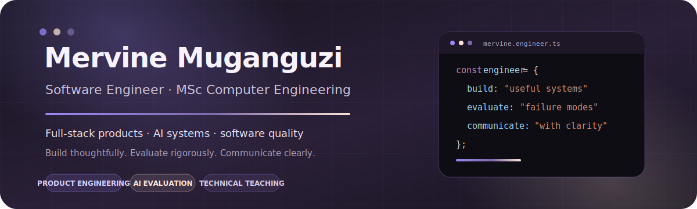

  

  <a href="https://mervine.dev"><strong>mervine.dev</strong></a>
  &nbsp;·&nbsp;
  <a href="https://mervine.dev/#projects">selected work</a>
  &nbsp;·&nbsp;
  <a href="https://mervine.dev/#contact">contact</a>

## Hi, I’m Mervine.

I’m a software engineer with an MSc in Computer Engineering. I build full-stack products and AI-enabled systems, with a particular interest in the parts that are easy to overlook: failure cases, confusing flows, weak assumptions, and the small details that decide whether software feels thoughtful or merely finished.

I like software that is useful, understandable, and honest about what it can do. I care about the code, but I also care about the person on the other side of it.

Teaching taught me to explain. Research taught me to question passing results. Design taught me to notice. All three shape the way I build.

## The way I build

- Start with the real problem, not the fashionable technology.
- Keep the interface clear and the code readable enough for someone else to follow.
- Test the happy path, then look for what breaks around it.
- Turn vague ideas into something structured, usable, and easier to improve.
- Treat product decisions and engineering decisions as part of the same conversation.

## A few things I’ve built

### [CPU Scheduler Simulator](https://github.com/MerveilleDivine/OS_project_scheduler)

A C++ command-line simulator for comparing CPU scheduling algorithms. It includes FCFS, SJF, Priority Scheduling, Round Robin, process metrics, regression tests, CMake, and GitHub Actions.

`C++` `Operating Systems` `Algorithms` `Testing` `CMake`

### [CIFAR-10 Image Classifier](https://github.com/MerveilleDivine/Image_Classifier)

A modular computer-vision project built around ResNet-50 fine-tuning, image-processing experiments, evaluation, and a Gradio prediction interface. The best validation accuracy recorded was **84.27%**.

`Python` `PyTorch` `Computer Vision` `ResNet-50` `Gradio`

### [Loops](https://mervine.dev/projects/loops)

A time-budgeting product for planning life more realistically. It focuses on flexible scheduling, clearer time allocation, and a calmer way to see where the day is going.

`React` `TypeScript` `Product Engineering` `UX`

### [Covenant Connect](https://mervine.dev/projects/covenant-connect)

A community platform with authentication, database-backed content, shared workflows, and web/mobile product thinking.

`React` `Supabase` `PostgreSQL` `Authentication`

  <a href="https://mervine.dev/#projects"><strong>See the rest of my work →</strong></a>

## The research behind some of my engineering habits

My MSc thesis was titled **“A Failure-Mode Analysis of an Agentic Coding System for Autonomous Software Engineering.”**

I studied coding agents across multi-step software-engineering tasks. I was interested in more than whether the final answer passed. I looked at what the agent changed, what it ignored, how it tested, when it recovered, and whether the final patch was genuinely clean.

That work made me more attentive to failure cases, testing discipline, debugging behaviour, and the danger of confusing a passing result with good engineering.

## What I work with

**Languages**  
Python · TypeScript · JavaScript · C · C++

**Frontend and mobile**  
React · Next.js · React Native · HTML · CSS · Tailwind CSS

**Backend and data**  
Node.js · FastAPI · REST APIs · PostgreSQL · Supabase · MongoDB · Redis

**Workflow**  
Git · GitHub Actions · Docker · WSL2 · testing · CI/CD fundamentals

**AI and evaluation**  
Agentic coding systems · benchmarking · software evaluation · computer vision · applied AI

## Beyond the stack

I enjoy teaching, design, music, and projects that begin with a real person and a real need. I tend to care about both the structure behind a product and the feeling someone has while using it.

  <strong>Useful software, built with care.</strong> 
  <a href="https://mervine.dev">Portfolio</a>
  &nbsp;·&nbsp;
  <a href="https://mervine.dev/#projects">Projects</a>
  &nbsp;·&nbsp;
  <a href="https://mervine.dev/#contact">Contact</a>

