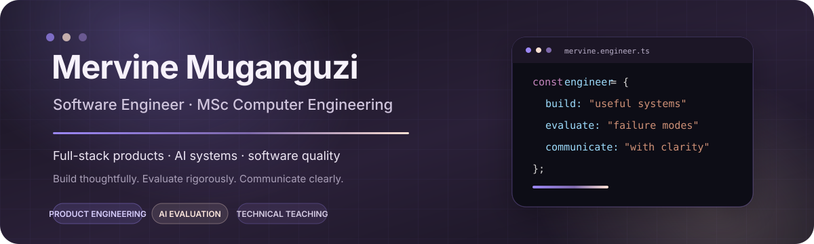

  

  <a href="https://www.mervine.dev"><strong>Portfolio</strong></a>
  &nbsp;·&nbsp;
  <a href="https://www.mervine.dev/#projects">Selected work</a>
  &nbsp;·&nbsp;
  <a href="https://www.mervine.dev/#contact">Contact</a>

## Hi, I’m Mervine.

**I build software that makes sense.**

To the people using it. To the engineers maintaining it. To the business it is meant to serve.

I’m a software engineer with an MSc in Computer Engineering. My work spans backend systems, full-stack products, mobile applications, and applied AI, but the standard stays the same: every feature, workflow, and technical decision should have a reason for being there.

## Public code

Four repositories with documented setup, implementation details, and automated checks:

| Project | What you can inspect |
|---|---|
| [Papa AI Toolbox](https://github.com/MerveilleDivine/papa-ai-toolbox) | A French-first React and TypeScript app for discovering AI tools, with shareable filters, tool detail pages, persistent favourites, and component tests. |
| [Remote Job Search](https://github.com/MerveilleDivine/remote-job-search) | A Python client for the JSearch API with CLI and Gradio interfaces, validated inputs, retries, deduplication, CSV export, and unit tests. |
| [CPU Scheduler Simulator](https://github.com/MerveilleDivine/cpu-scheduler-simulator) | A C++ simulator for FCFS, SJF, SRTF, Priority, and Round Robin, with comparison mode, text and JSON reports, CMake, CTest, and regression tests. |
| [CIFAR-10 Image Classifier](https://github.com/MerveilleDivine/cifar10-image-classifier) | A modular PyTorch project for ResNet-50 fine-tuning, image-processing experiments, evaluation, and Gradio inference, with deterministic data-split and preprocessing tests. |

The CIFAR-10 project's **84.27% validation accuracy** comes from the original experiment. The current architecture and data split require a fresh training and evaluation run before reporting new results.

## Products and case studies

| Product | What I built | Explore |
|---|---|---|
| **Norland RDC** | A French-first e-commerce and distributor platform with product discovery and customer workflows. Next.js, TypeScript, Supabase, and PostgreSQL. | [Case study](https://www.mervine.dev/projects/norland-rdc) |
| **LOOPS** | A time-budgeting product for flexible scheduling and clearer time allocation. React, TypeScript, Supabase, and PostgreSQL. | [Case study](https://www.mervine.dev/projects/loops) |
| **Covenant Connect** | Web and mobile experiences for couples, including shared goals, plans, communication, and daily check-ins. React, React Native, Expo, and Supabase. | [Case study](https://www.mervine.dev/projects/covenant-connect) |
| **Equitas RDC** | A public-interest platform that presents the organisation's mission and makes participation easier. React, TypeScript, Tailwind CSS, and Supabase. | [Case study](https://www.mervine.dev/projects/equitas-rdc) |

These case studies cover product decisions, my role, and the implementation. Source repositories for these products are private.

  <a href="https://www.mervine.dev/#projects"><strong>Explore all my projects →</strong></a>

## Research

My MSc thesis, **“A Failure-Mode Analysis of an Agentic Coding System for Autonomous Software Engineering,”** examined 100 recorded SWE-agent trajectories on SWE-bench Lite.

I looked beyond whether the final patch passed. I studied what the agent changed, how it tested, when it recovered, and whether the result was genuinely clean. Across the evaluation, 53 runs produced resolving patches, of which 21 met the study’s stricter clean-resolution criteria.

That work shaped the way I approach debugging, testing, evaluation, and the gap between software that passes and software that is well engineered.

## What I work with

**Languages**  
Python · TypeScript · JavaScript · C · C++

**Frontend and mobile**  
React · Next.js · React Native · HTML · CSS · Tailwind CSS

**Backend and data**  
Node.js · FastAPI · REST APIs · PostgreSQL · Supabase · MongoDB · Redis

**Engineering workflow**  
Git · GitHub Actions · Docker · testing · CI/CD fundamentals

**AI and evaluation**  
Agentic coding systems · benchmarking · software evaluation · computer vision · applied AI

  <strong>Software that makes sense.</strong> 
  <a href="https://www.mervine.dev">Portfolio</a>
  &nbsp;·&nbsp;
  <a href="https://www.mervine.dev/#projects">Projects</a>
  &nbsp;·&nbsp;
  <a href="https://www.mervine.dev/#contact">Contact</a>

