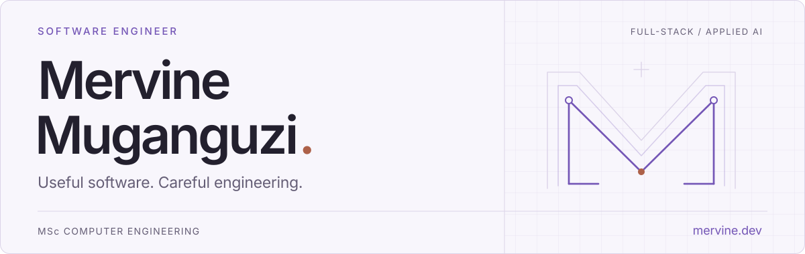

<a href="https://www.mervine.dev/">
  <picture>
    <source media="(max-width: 600px) and (prefers-color-scheme: dark)" srcset="./assets/profile/header-dark-compact.svg" />
    <source media="(max-width: 600px) and (prefers-color-scheme: light)" srcset="./assets/profile/header-light-compact.svg" />
    <source media="(prefers-color-scheme: dark)" srcset="./assets/profile/header-dark.svg" />
    
  </picture>
</a>

  <a href="https://www.mervine.dev/">Website ↗</a>
  &nbsp;&nbsp;·&nbsp;&nbsp;
  <a href="https://www.linkedin.com/in/mervine-muganguzi-981568236/">LinkedIn ↗</a>
  &nbsp;&nbsp;·&nbsp;&nbsp;
  <a href="https://www.mervine.dev/#contact">Get in touch ↗</a>

I’m Mervine, a software engineer with an MSc in Computer Engineering. I build full-stack products and backend systems, and study the reliability of AI coding agents.

I care about what happens after the first working version: whether the interface is clear, the code is maintainable, and the system behaves well when something goes wrong.

## Research · Beyond a passing patch

My MSc research examined how AI coding agents fail, not just whether they solve a task. I analysed 100 SWE-agent trajectories on SWE-bench Lite, tracing code changes, testing behaviour, and recovery attempts.

> 53 of 100 runs produced resolving patches. Of those, 21 met the study’s stricter clean-resolution criteria.

That distinction shapes how I approach AI-assisted development: inspect the process, verify the result, and make the limits explicit.

  
Thesis title

  
<em>A Failure-Mode Analysis of an Agentic Coding System for Autonomous Software Engineering.</em>

## Selected public work

### [Papa AI Toolbox ↗](https://github.com/MerveilleDivine/papa-ai-toolbox)

A French-first introduction to AI tools, originally built for my father. It turns a crowded subject into practical guidance, with shareable filters, tool detail pages, and persistent favourites.

React · TypeScript · Component tests

### [Remote Job Search ↗](https://github.com/MerveilleDivine/remote-job-search)

A Python API client with CLI and Gradio interfaces. Input validation, retry handling, deduplication, and CSV export keep the search workflow useful beyond the happy path.

Python · REST APIs · Gradio · Unit tests

### [CPU Scheduler Simulator ↗](https://github.com/MerveilleDivine/cpu-scheduler-simulator)

Five scheduling algorithms, compared on the same workload. I revisited a university project to separate parsing, scheduling, and reporting, with text and JSON output and regression tests.

C++ · CMake · CTest · GitHub Actions

### [CIFAR-10 Image Classifier ↗](https://github.com/MerveilleDivine/cifar10-image-classifier)

A modular ResNet-50 training and evaluation pipeline with image-processing experiments and Gradio inference. Data splits, preprocessing, and evaluation are explicit rather than hidden in one training script.

Python · PyTorch · Computer vision · Gradio

## Products & case studies

Alongside public code, I build user-facing products. These links cover the product decisions and implementation; their source repositories are private.

[Norland RDC ↗](https://www.mervine.dev/projects/norland-rdc)  
French-first commerce, product discovery, and distributor workflows.

[LOOPS ↗](https://www.mervine.dev/projects/loops)  
Time budgeting and flexible scheduling, built around how people plan their days.

[Covenant Connect ↗](https://www.mervine.dev/projects/covenant-connect)  
Web and mobile experiences for shared goals, plans, and daily check-ins.

[Equitas RDC ↗](https://www.mervine.dev/projects/equitas-rdc)  
A public-interest platform for clearer information and easier participation.

## My usual toolkit

Python · TypeScript · JavaScript · C · C++  
React · Next.js · React Native · Node.js · FastAPI  
PostgreSQL · Supabase · PyTorch · Docker · GitHub Actions

---

For engineering work, collaborations, or research conversations, [get in touch](https://www.mervine.dev/#contact) or [connect on LinkedIn](https://www.linkedin.com/in/mervine-muganguzi-981568236/).
