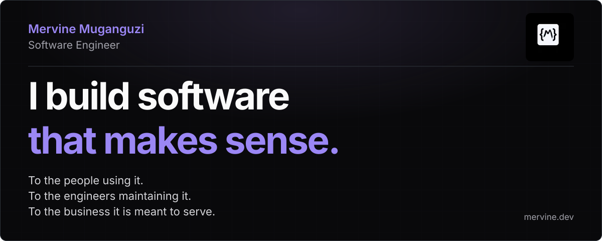

<a href="https://www.mervine.dev/">
  <picture>
    <source media="(max-width: 600px)" srcset="./assets/profile/website-header-compact.svg" />
    
  </picture>
</a>

  <a href="https://www.mervine.dev/">Website</a>
  &nbsp;·&nbsp;
  <a href="https://www.linkedin.com/in/mervine-muganguzi-981568236/">LinkedIn</a>
  &nbsp;·&nbsp;
  <a href="https://www.mervine.dev/#contact">Contact</a>

I'm Mervine, a software engineer with an MSc in Computer Engineering. I build web and mobile applications and their backends. My work includes a commerce platform for Norland RDC, the LOOPS time-budgeting app, and research on AI coding agents.

## Public projects

### [Papa AI Toolbox](https://github.com/MerveilleDivine/papa-ai-toolbox)

I built this for my father to help him try AI tools in French. It includes explanations, example prompts, search, and saved favourites.

React · TypeScript

### [Remote Job Search](https://github.com/MerveilleDivine/remote-job-search)

A Python app for searching roles through the JSearch API, removing duplicates, and exporting results to CSV. It has a command-line interface, a Gradio interface, and tests for the API client.

Python · Gradio · REST APIs

### [CPU Scheduler Simulator](https://github.com/MerveilleDivine/cpu-scheduler-simulator)

A university operating systems project I later refactored. It compares five scheduling algorithms on the same input and produces timelines, performance metrics, and JSON reports.

C++ · CMake · CTest

### [CIFAR-10 Image Classifier](https://github.com/MerveilleDivine/cifar10-image-classifier)

A ResNet-50 image classification project built with PyTorch. Training, image processing, evaluation, and Gradio inference are split into separate modules.

Python · PyTorch · Gradio

## Product work

These projects have private source repositories. Their case studies are on my website.

[Norland RDC](https://www.mervine.dev/projects/norland-rdc)  
A commerce platform with a product catalogue and distributor workflows.

[LOOPS](https://www.mervine.dev/projects/loops)  
An app for budgeting time and planning schedules.

[Covenant Connect](https://www.mervine.dev/projects/covenant-connect)  
Web and mobile apps for couples to share goals, plans, and daily check-ins.

[Equitas RDC](https://www.mervine.dev/projects/equitas-rdc)  
An organisation's website presenting its work and ways to get involved.

## Research

My MSc thesis, *A Failure-Mode Analysis of an Agentic Coding System for Autonomous Software Engineering*, studied SWE-agent on SWE-bench Lite.

I reviewed 100 recorded runs, following the agent's code changes, tests, and attempts to recover from mistakes. In that evaluation, 53 runs resolved the task, and 21 of those met the study's stricter clean-resolution criteria.

## Technologies

Python · TypeScript · JavaScript · C · C++  
React · Next.js · React Native · FastAPI · Node.js  
PostgreSQL · Supabase · PyTorch · Docker · GitHub Actions

---

[More about me](https://www.mervine.dev/about) · [Get in touch](https://www.mervine.dev/#contact)
